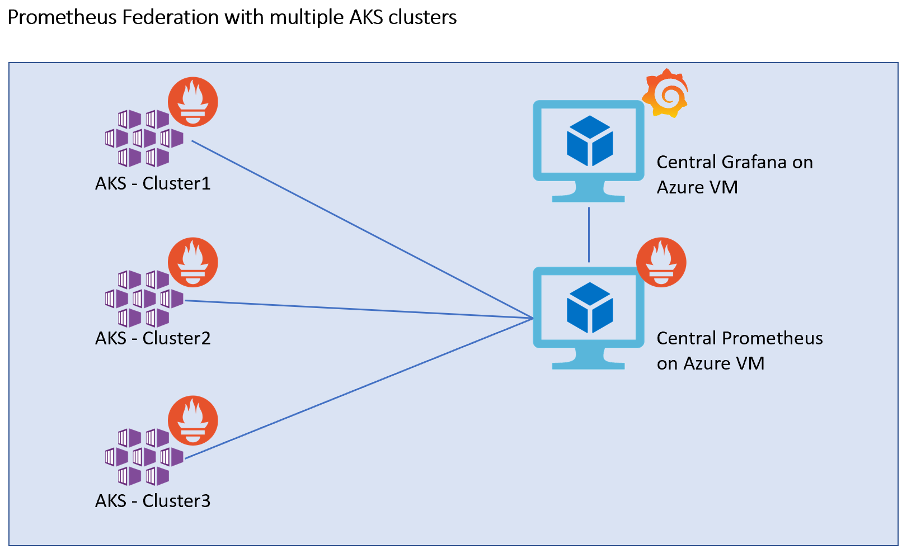
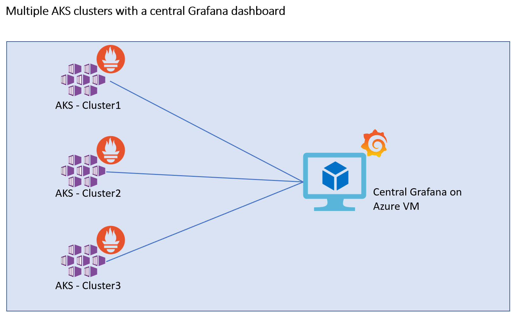
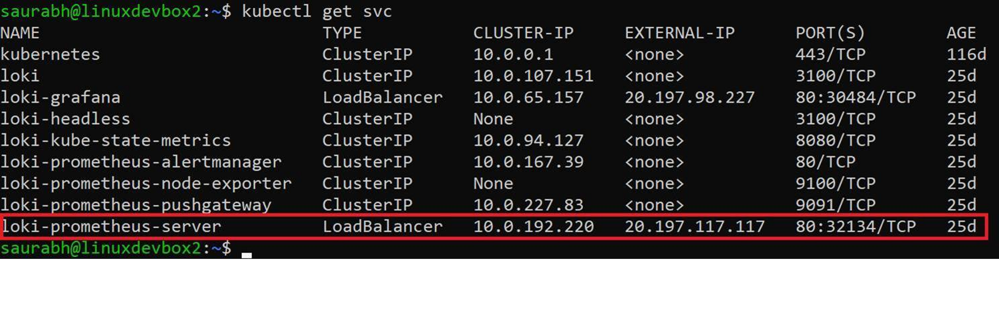
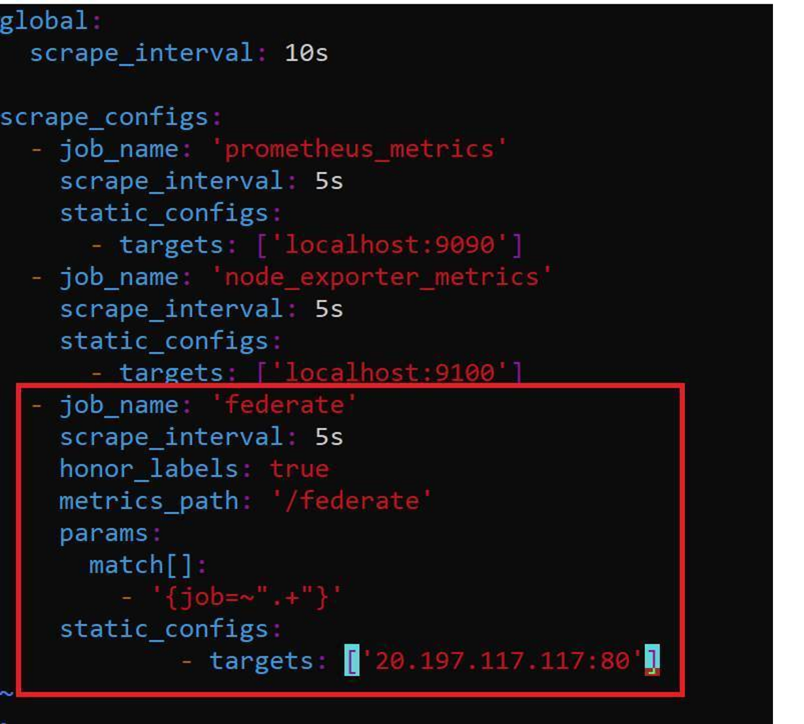
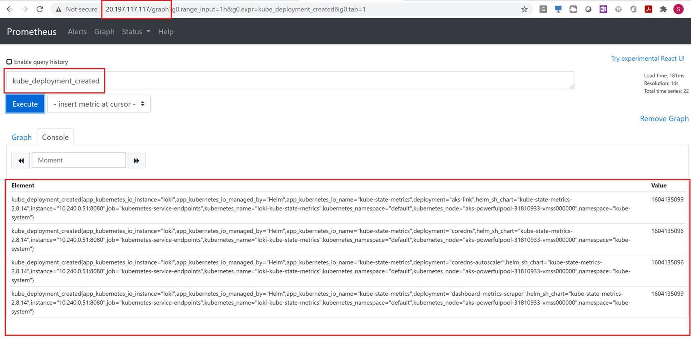
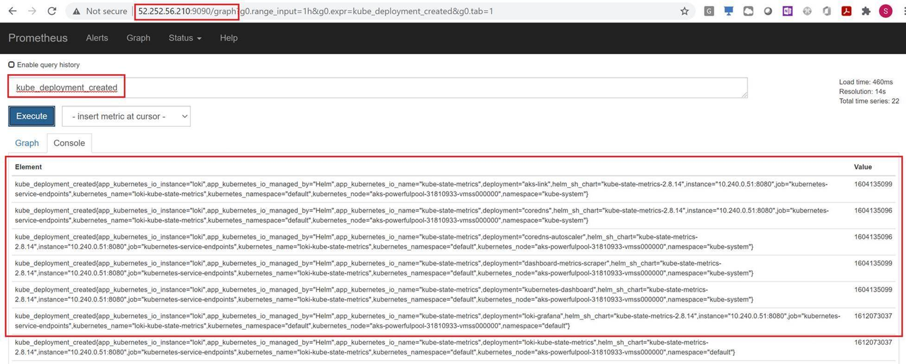
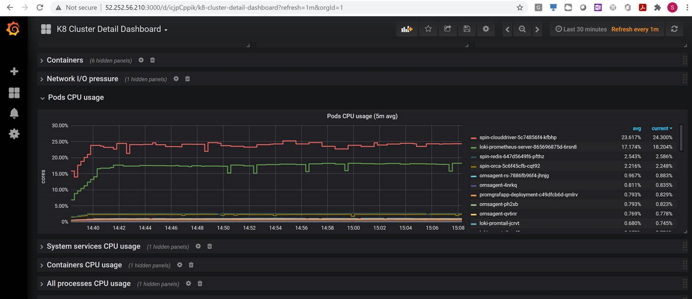

# Monitoring a multi-cluster AKS environment using Prometheus and Grafana

In case of Prometheus and Grafana based monitoring for a multi-cluster AKS environment setup,  there always is a question as to how the set up should look like. 
One of the set of guard rails for the same can be as follows:

1. For the scenarios where aggregation of metrics across multiple AKS clusters is desired - for example having  at least one **local** Prometheus server in an Azure set up for one customer and having a **global** Prometheus server for pulling up the aggregated metrics from multiple such **local** Prometheus servers to get the metrics for **all** the customers together (example: across the multiple AKS clusters how many pods for an application are running) - **Prometheus Federation** can be implemented. Essentially Prometheus Federation is considered to be a hierarchical setup where the **global** Prometheus server pulls up the aggregated metrics from multiple **local** Prometheus servers.    

2. For viewing the metrics of multiple AKS clusters individually the approach of having a **Central Grafana** dashboard with individual AKS clusters each having a Prometheus instance running and these Prometheus instances added as **datasources** to the **Central Grafana** dashboard can be used.  
There can be an inherent tilt in deciding to implement a Central Prometheus server approach here using Prometheus Federation  where we can have the Central Prometheus server federate across multiple clusters and have the Grafana sitting on top of only this Central Prometheus server. However this approach has a risk of overwhelming the Centralized Prometheus server with lot of metrics data flowing in.  
Hence the recommended approach would be to go for individual AKS-Prometheus services to be added as individual data sources to a Central Grafana dashboard ... and only use the Prometheus Federation approach for dashboarding and alerting at a global level.    

3. For long term retention of the metrics or back up of the metrics, the option of **remote_write** can be used to write all the metrics from individual AKS clusters to any desired datasources, for example - **InfluxDB**. In case of any data loss, we can have the new Prometheus server instance created and have its remote_read pointed to this instance of **InfluxDB** - so that the same Grafana dashboards with the same **PromQL** queries be used.
If a remote_write based back up is not desired due to any reasons, then the simple option of taking disk snapshots of the Prometheus server can be done ... although the snapshots have to be taken at a higher frequency if the loss of the metrics data is to be minimized.

## Disclaimer:
I am not an expert on Prometheus. After various discussions, exploring various options and reading, I have come up with the above guardrails. There can be various other ways in implementing monitoring for multi-cluster AKS set-up using Prometheus and Grafana.  
Thank you Stuart (https://github.com/stuart-c) for guidance on this.

## Prometheus Federation set-up

### My AKS based Prometheus service:

### My Prometheus.yaml file on Centralized Prometheus Server on an Azure Ubuntu VM
Here I have configured the IP address of my Prometheus Service on AKS

### AKS based Prometheus portal:

### Central Prometheus Server on an Azure Ubuntu VM:
Here we see the same metrics from the AKS cluster 

### My Grafana dashboard with data source as the Central Prometheus Server on Azure Ubuntu VM: 
Here it is able to display the federated metrics from AKS

## Reference links:
Azure Kubernetes Service: https://docs.microsoft.com/en-us/azure/aks/   
Azure VM: https://docs.microsoft.com/en-us/azure/virtual-machines/   
Prometheus Federation:  
https://prometheus.io/docs/prometheus/latest/federation/  
https://medium.com/@jotak/prometheus-federation-in-kubernetes-4ce46bda834e  
https://docs.d2iq.com/mesosphere/dcos/services/prometheus/0.1.0-2.3.2/configuration/prometheus-federation/   
Prometheus **remote_write** and **remote_read**
https://prometheus.io/docs/operating/integrations/  
https://docs.influxdata.com/influxdb/v1.8/supported_protocols/prometheus/  

